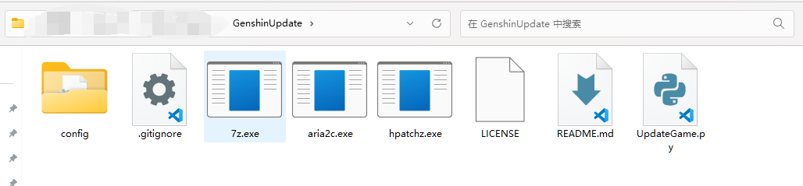

# GenshinUpdate
a python script to update GenshinImpact
## 使用方法
1. 克隆本项目
    ```commandline
    git clone https://github.com/qiyue32108/GenshinUpdate.git
    ```
2. 进入目录
    ```commandline
    cd ./GenshinUpdate
    ```
3. 将`7z.exe`,`aria2c.exe`,`hpatchz.exe`复制到目录下

4. 执行命令 
    ```commandline
    python ./UpdateGame.py -p "FullGamePath"
    ```
    例如
    ```commandline
    python ./UpdateGame.py -p "D:/Genshin Impact/Genshin Impact Game"
    ```
---
## 其他问题
+ 如果游戏本体目录下内没有`config.ini`,将无法判断游戏版本和游戏服务器,可以自行将目录下的`config`文件夹内的模板复制到游戏本体目录下,修改里面的`game_version`为当前版本号,并且重命名为`config.ini`
+ 3.6.0版本原神音频文件的目录结构发生改变,由
`YuanShen_Data(GenshinImpact_Data)\StreamingAssets\Audio\GeneratedSoundBanks\Windows`变更为`YuanShen_Data(GenshinImpact_Data)\StreamingAssets\AudioAssets`,若更新至3.6.0版本,请在更新之前自行调整好路径,否则音频文件会更新失败
---
## 三个exe的获取方式
+ [7z.exe](https://sparanoid.com/lab/7z/download.html)
+ [aria2c.exe](https://github.com/aria2/aria2/releases)
+ [hpatchz.exe](https://github.com/sisong/HDiffPatch/releases)

PS：`7z.exe` & `hpatch.exe`可在官方启动器根目录下找到